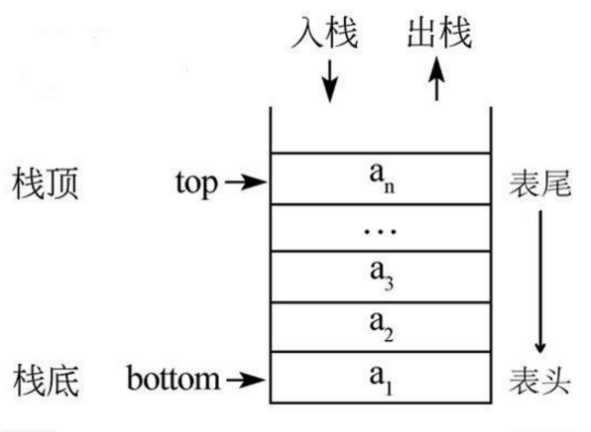

## 数据结构

### 数组

#### 实现方式

初始化数组元素大小 x，和元素个数 n。开辟一段 x*n 大小的连续存储空间，以首个元素地址作为数组地址（记为 a），就可以按索引（记为 i）计算出指定数组元素地址 （公式 a + i * x）

#### 查找、排序

### 链表

#### 实现方式

链表每个节点包含存储数据和指针，指针指向下个链表节点，实现单向链表

#### 插入、查找

### 字典（哈希表）

#### 实现方式

一般使用数组，字典 key 值通过 hash 函数映射到数组索引，从而直接获取 value。如果出现多个 key 通过 hash 函数映射出来的值相同，即 hash 冲突，就需要采用开放定址法、链址法等

#### Hash 冲突解决方法

##### 开放定址法

##### 链址法

### 集合

特点：无序，且不重复

#### 实现方式

通过 hash 表实现，key 为集合元素，value 存 null 值即可

### 树

#### 分类

##### 二叉树

分类

- 完全二叉树

- 平衡二叉树

	- 规则

		- 非叶节点最多两个字节点

		- 非叶节点大于left child，小于right child

		- 左右层级数相差不大于1

		- 没有相同值的节点

	- 基于二分法

- 二叉查找树（BST）

- 线索二叉树

	- 双向线索二叉树

- 哈夫曼树（最优二叉树）

	- 哈夫曼编码

- 红黑树

存储

- 顺序存储

- 链式存储

遍历

根据访问结点时机的不同，分为三种遍历方式：  

- 先访问根结点，再遍历左右子树，称为“先序遍历”；  
- 遍历左子树，之后访问根结点，然后遍历右子树，称为“中序遍历”；  
- 遍历完左右子树，再访问根结点，称为“后序遍历”。

##### B 树 （平衡多路查找树）

规则

- 节点关键字递增排序

- 非叶节点的子节点数>1且<=M, M>=2，空树除外
  M阶代表一个树节点最多有多少个查找路径，M=M路,当M=2则是2叉树,M=3则是3叉

- 枝节点关键字数>=ceil(m/2)-1且<=M-1

- 叶子节点都在同一层

B+ 树

- 规则

	- 非叶子节点不记录关键字

	- 叶子节点保存了所有关键字指针

	- 叶子节点从小到大排序，链表连接

	- 非叶子节点数等于关键字数

- 相较B树

	- 层级更少

	- 全节点遍历更快

	- 天然具备排序功能

	- 查询速度更稳定

##### LSM 树 （Log-Structured Merge Tree 日志结构合并树）

##### Trie 树

### 图

[推荐文章](https://zhuanlan.zhihu.com/p/25498681)

#### 分类

- 是否有向

  - 有向图

  - 无向图

- 是否有权

  - 有权图

  - 无权图

- 是否连通

  - 连通图
    所有的点都有路径相连
  - 非连通图
    存在某两个点没有路径相连
    
#### 顶点

  - 度

  - 入度

  - 出度

#### 表示

  - 邻接矩阵
  - 邻接链表

#### 遍历

  - 广度优先搜索 (Breadth First Search)

  - 深度优先搜索 (Depth First Search)

### 队列

特点：先进先出（First-In-First-Out, FIFO)

#### 实现方式

数组和链表都可以，只需要保证先进先出就好

### 栈

特点：后进先出（Last-in-first-out， LIFO）

#### 实现方式

数组和链表都可以，只需要保证后进先出就好

