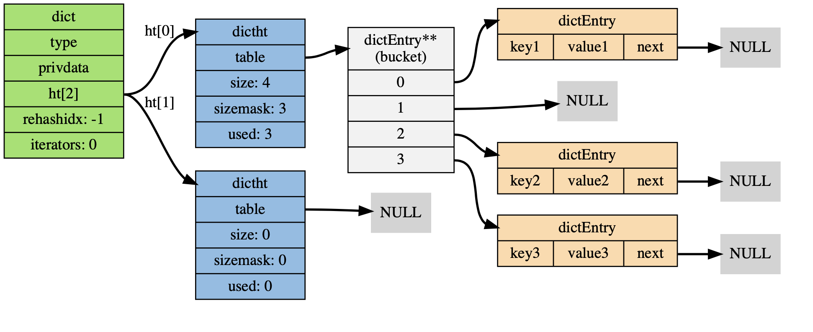

## redis


### 数据结构与对象

#### 字符串

##### 实现

数据结构：

```c
// simple dynamic string, SDS
struct sdshdr {
    
    // buf 中已占用空间的长度
    int len;

    // buf 中剩余可用空间的长度
    int free;

    // 数据空间
    char buf[];
};
```

特点：

- 记录了字符串长度，获取长度只需要 O(1) 的复杂度

- 需要额外的一个字节空间保存 \0 空字符， 应该是为了兼容 c 语言的字符串， 此空字符串，不计算再 len 长度中

- 空间不足时，自动扩充空间，不会造成溢出， 即空间预分配。 也避免了因为修改字符串，而造成频繁的内存重分配
  - 小于 1MB 时， 扩充 free 与 len 一致
  - 大于等于 1MB 时，扩充 free 1MB 
  
- 空间惰性释放，如果缩短字符串，增加 free 长度，等待之后使用，不进行内存重分配

- 通过 len 进行长度获取， 而不是特定字符分割，避免字符串的限制、过滤和修改，从而保证二进制安全，可以保存二进制数据

- 兼容部分C字符串函数

##### 命令：

  - set/mset

  - get/mget

#### 链表

可实现队列

##### 实现

数据结构

```c
typedef struct listNode{
	// 前节点指针
	struct listNode *prev;
	// 后节点指针
	struct listNode *next;
	// 数据指针
	void *value;
}listNode;

typedef struct list{
	// 链表头结点
	listNode *head;
	// 链表尾节点
	listNode *tail;
	// 链表包含节点数
	unsigned long len;
	// 节点复制函数
	void *(*dup)(void *ptr);
	// 节点值释放函数
	void (*free)(void *prt);
	// 节点值对比函数
	void (*match)(void *ptr, void *key);
}list;
```

特点：

- 双端，前后指针

- 无环

- 带表头表尾指针

- 带长度计数器

- 多态，保存各种类型值

##### 命令

- rpush/lpush
- rpop/lpop
- brpush/blpush
- brpop/blpop
  没有元素时，阻塞状态，直到等待超时或发现有元素为止
- list

#### 字典

##### 实现



数据结构：

```c
/*
 * 字典
 *
 * 每个字典使用两个哈希表，用于实现渐进式 rehash
 */
typedef struct dict {
    // 特定于类型的处理函数
    dictType *type;
    // 类型处理函数的私有数据
    void *privdata;
    // 哈希表（2 个），ht[0] 是主要使用的哈希表， 而 ht[1] 则只有在对 ht[0] 哈希表进行 rehash 时才使用
    dictht ht[2];
    // 记录 rehash 进度的标志，值为 -1 表示 rehash 未进行
    int rehashidx;
    // 当前正在运作的安全迭代器数量
    int iterators;
} dict;

typedef struct dictht{
    // 哈希表数组 
    dictEntry **table;
    // 哈希表大小
    unsigned long size;
  	// 哈希表大小掩码，用于计算索引值
    unsigned long sizemask;
    // 该 hash 表已有节点数量
    unsigned long used;
}

typedef struct dictEntry{
   // 键
   void *key;
   // 值
   union{
      void *val;
      uint_64_tu64;
      int64_ts64;
     } v
   // 下个节点指针, 这里使用链地址法来解决哈希冲突
   struct dictEntry *next;
}dictEntry;
```

特点：

- 哈希表实现
- 哈希冲突使用链地址法解决
- 渐进式 rehash

##### 渐进式 rehash
判断条件：

在每次添加新键值对时，都会对检查 ht[0] 的 size 和 used 属性，计算出它们之间的比率 `ratio = used / size`

  - 需要 rehash: 如果 ratio >= 1,  `dict_can_resize` 为真。 在诸如后台持久化（bgsave）的时候，需要一般不处理 rehash，除非强制执行
  - 强制 rehash: 如果 ratio > `dict_force_resize_ratio` (一般默认配置为 5)，

触发时机：

- 在增删查时惰性触发，并且只有`ht[0]->table` 哈希表第一个不为空的索引上的所有节点就会全部迁移到 `ht[1]->table`
- 在 Redis 的定时任务（server cron job）中执行，对数据库字典进行主动 rehash 

rehash 过程中的其他注意点：

- 删查等操作时， ht[0] 和 ht[1] 都要执行

- 添加操作，只在 ht[1] 中执行，ht[0] 只减不增

收缩 rehash

条件： 如果 ratio < `REDIS_HT_MINFILL`(一般默认为 10% )


###### 命令

- hsetnx
  Adds a value to the hash stored at key only if this field isn't already in the hash.

- hlen

- hdel

- hgetall

- hincrby

- hincrbyfloat

- hexists

- hmset

- hvals

- hmget

- hkeys

- hget

- hset

### 跳跃表 skip list

- 命令

	- zadd
	  Time complexity: O(log(N)) for each item added, where N is the number of elements in the sorted set.

	- zrem
	   O(M*log(N)) with N being the number of elements in the sorted set and M the number of elements to be removed.

	- zrange/zrevrange
	  O(log(N)+M) with N being the number of elements in the sorted set and M the number of elements returned.

	- zrangebyscore/zrevrangebyscore
	  O(log(N)+M) with N being the number of elements in the sorted set and M the number of elements being returned. If M is constant (e.g. always asking for the first 10 elements with LIMIT), you can consider it O(log(N)).

	- zrangebylex/zrevrangebylex

	- zcount
	  O(log(N)) with N being the number of elements in the sorted set.

	- zremrangebyscore

	- zremrangebyrank

	- zcard
	  O(1)

	- zscore

	- zrank/zrevrank
	  O(log(N))

	- zincrby
	   O(log(N)) where N is the number of elements in the sorted set.

	- zinterstore

### set 集合

- sadd

- scard

- sdiff
  O(N) where N is the total number of elements in all given sets.  
  
  差集

- srem

- sismemeber

- spop

- srandmember

- smove

- sunion
  O(N) where N is the total number of elements in all given sets.  
  
  并集

- sunionstore
  O(N) where N is the total number of elements in all given sets.

- sinter
  O(N*M) worst case where N is the cardinality of the smallest set and M is the number of sets.  
  
  交集

- sinterstore

### 压缩列表 zip list

### 对象

- 命令

	- object

- 字符串对象

- 列表对象

- 哈希对象

- 集合对象

- 有序集合对象

- 内存回收

	- 引用计数

- 对象空转时长
  空转时长：当前时间减去最后一次被命令程序访问的时间

## 持久化

### RDB

- 保存和还原所有键值对数据

- save 命令

	- 主进程执行，阻塞服务器

- bgsave 命令

	- 子进程执行，非阻塞

### AOF（Append Only File）

AOF 文件通过保存所有修改数据库的命令来记录数据库的状态。  

AOF 文件中的所有命令都以 Redis 通讯协议的格式保存。

- AOF重写

## 事务 transaction

注意：  
事务执行过程某条命令发生了错误，仍会继续执行其他命令

### 命令

- MULTI

	- 事务开始

- EXEC

	- 事务执行

- WATCH
  watch 会在事务开始之前盯住 1 个或多个关键变量，当事务执行时，也就是服务器收到了 exec 指令要顺序执行缓存的事务队列时，Redis 会检查关键变量自 watch 之后，是否被修改了 (包括当前事务所在的客户端)。如果关键变量被人动过了，exec 指令就会返回 null 回复告知客户端事务执行失败，这个时候客户端一般会选择重试。  
  
  注意：  
  Redis 禁止在 multi 和 exec 之间执行 watch 指令，而必须在 multi 之前做好盯住关键变量，否则会出错。

	- 监视数据库键

- DISARD

	- 事务丢弃

## 过期

存在一个expires的过期字典，保存数据库中所有键过期时间

### 设置过期时间

- expire

	- 设置ttl秒

- pexpire

	- 设置ttl毫秒

- expireat

	- 指定秒级时间戳作为过期时间点

- pexpireat

	- 指定毫秒时间戳作为过期时间点

### 移除过期时间

- persist

### 返回剩余过期时间

- ttl

### 过期策略

- 惰性删除策略

- 定期删除策略

	- 随机取一定数量键， 删除其中的过期键

	- 执行时长

	- 执行频率

- 其他模块影响

	- 生成rdb文件

	- 载入rdb文件

	- AOF文件写入

	- AOF重写

	- 复制
	  从库不会进行过期扫描，从库对过期的处理是被动的

## 扩展

### Bloom Filter 布隆过滤器

- bf.add

- bf.exists

- bf.madd

- Bf.mexists

### 位图

- getbit

- setbit

- bitcount

- bitpos

- bitfield

### Lua 脚本

- 命令

	- eval

	- script load 

	- evalsha

### pipeline

### 发布与订阅

- stream

	- 优点

		- 可以获取历史发送的消息

- PUB/SUB

	- 缺点

		- 消息不能持久化
		  PubSub 的生产者传递过来一个消息，Redis 会直接找到相应的消费者传递过去。如果一个消费者都没有，那么消息直接丢弃。如果开始有三个消费者，一个消费者突然挂掉了，生产者会继续发送消息，另外两个消费者可以持续收到消息。但是挂掉的消费者重新连上的时候，这断连期间生产者发送的消息，对于这个消费者来说就是彻底丢失了。  
		  
		  如果 Redis 停机重启，PubSub 的消息是不会持久化的，毕竟 Redis 宕机就相当于一个消费者都没有，所有的消息直接被丢弃。

	- 命令

		- subscribe

			- 订阅频道

		- unsubscribe

			- 退订频道

		- psubscribe

			- 根据正则订阅频道

		- unsubscribe

			- 根据正则退订频道

		- publish

			- 发布消息

		- pubsub

			- 查看订阅信息

### HyperLogLog

- pfadd

- pfcount

- pfmerge

## 内存淘汰策略

### noeviction(默认策略)

对于写请求不再提供服务，直接返回错误（DEL请求和部分特殊请求除外）

### allkeys-lru

从所有key中使用LRU算法进行淘汰

### allkeys-random

从所有key中随机淘汰数据

### volatile-lru

从设置了过期时间的key中使用LRU算法进行淘汰

### volatile-random

从设置了过期时间的key中随机淘汰

### volatile-ttl

在设置了过期时间的key中，根据key的过期时间进行淘汰，越早过期的越优先被淘汰

## 事件

### 单进程单线程处理客户端请求

### redis服务器是一个事件驱动程序

### 文件事件

- 基于Reactor模式

- 组成

	- 套接字

	- I/O多路复用
	  [https://draveness.me/redis-io-multiplexing ](https://draveness.me/redis-io-multiplexing)

	- 文件事件分派器

	- 事件处理器

### 时间事件

- serverCron

## 集群

### Sentinel

 Redis-Sentinel(哨兵模式)是Redis官方推荐的高可用性(HA)解决方案，当用Redis做Master-slave的高可用方案时，假如master宕机了，Redis本身(包括它的很多客户端)都没有实现自动进行主备切换，而Redis-sentinel本身也是一个独立运行的进程，它能监控多个master-slave集群，发现master宕机后能进行自懂切换。

- 监控 Monitoring

- 提醒 Notification

- 自动故障迁移 Automatic failover

### Cluster

Redis Cluster是Redis的分布式解决方案，在Redis 3.0版本正式推出的，有效解决了Redis分布式方面的需求。当遇到单机内存、并发、流量等瓶颈时，可以采用Cluster架构达到负载均衡的目的。

### Codis

国人写的集群中间件

### 分布式锁

- 命令

	- setnx
	  > setnx lock:codehole true  
	  OK  
	  > expire lock:codehole 5  
	  ... do something critical ...  
	  > del lock:codehole  
	  (integer) 1

	- expire

	- del

	- set
	  setnx 和 expire 组合在一起的原子指令  
	  set lock-codehole true ex 5 nx

- 限制程序的并发执行

## 复制

### 命令

- SYNC
  主服务器是 Redis 2.8 之前的版本  
  
  运行原理：  
  
  无论是初次连接还是重新连接， 当建立一个从服务器时， 从服务器都将向主服务器发送一个 SYNC 命令。  
  
  接到 SYNC 命令的主服务器将开始执行 BGSAVE ， 并在保存操作执行期间， 将所有新执行的写入命令都保存到一个缓冲区里面。  
  
  当 BGSAVE 执行完毕后， 主服务器将执行保存操作所得的 .rdb 文件发送给从服务器， 从服务器接收这个 .rdb 文件， 并将文件中的数据载入到内存中。  
  
  之后主服务器会以 Redis 命令协议的格式， 将写命令缓冲区中积累的所有内容都发送给从服务器。

- PSYNC
  主服务器是 Redis 2.8 或以上版本

	- 完整重同步 full resynchronization

		- 执行 BGSAVE 

		- 发送rdb文件

		- 发送缓冲区累积的写命令

	- 部分重同步 partial resynchronization
	  主服务器为被发送的复制流创建一个内存缓冲区（in-memory backlog）， 并且主服务器和所有从服务器之间都记录一个复制偏移量（replication offset）和一个主服务器 ID （master run id）， 当出现网络连接断开时， 从服务器会重新连接， 并且向主服务器请求继续执行原来的复制进程：  
	  
	  如果从服务器记录的主服务器 ID 和当前要连接的主服务器的 ID 相同， 并且从服务器记录的偏移量所指定的数据仍然保存在主服务器的复制流缓冲区里面， 那么主服务器会向从服务器发送断线时缺失的那部分数据， 然后复制工作可以继续执行。  
	  否则的话， 从服务器就要执行完整重同步操作。

		- 主服务器复制偏移量（replication offset）和从服务器复制偏移量 

		- 主服务器复制挤压缓冲区（replication backlog）

		- 服务器运行ID （run ID）

### 支持主从同步和从从同步

### 异步复制

## 通信协议

### RESP(Redis Serialization Protocol)

- 单元类型

	- 单行字符串

		- 以+符号开头
		  +hello world\r\n

	- 多行字符串

		- 以$符号开头，后跟字符串长度
		  $11\r\nhello world\r\n  
		  
		  空串 用多行字符串表示，长度填 0。  
		  $0\r\n\r\n  
		  
		  注意这里有两个\r\n，为什么是两个，因为两个\r\n 之间隔的是空串。

	- 整数值

		- 以:符号开头，后跟整数的字符串形式
		  :1024\r\n

	- 错误消息

		- 以-符号开头
		  -WRONGTYPE Operation against a key holding the wrong kind of value\r\n

	- 数组

		- 以*号开头，后跟数组的长度
		  *3\r\n:1\r\n:2\r\n:3\r\n  
		  
		  直观打印如下：  
		  
		  *3  
		  :1  
		  :2  
		  :3

	- NULL

		- 用多行字符串表示，不过长度要写成-1
		  $-1\r\n

- 单元结束

	- \r\n

---

参考资料：

- 《redis 设计与实现》黄健宏著

