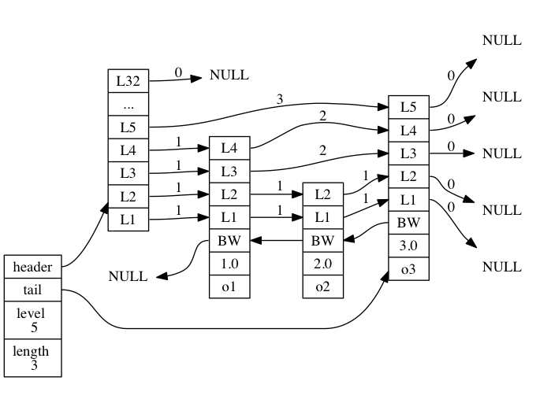

## 数据结构与对象

### 字符串

#### 数据结构

```c
// simple dynamic string, SDS
struct sdshdr {
    // buf 中已占用空间的长度
    int len;
    // buf 中剩余可用空间的长度
    int free;
    // 数据空间
    char buf[];
};
```

#### 特点

- 记录了字符串长度，获取长度只需要 O(1) 的复杂度

- 需要额外的一个字节空间保存 \0 空字符， 应该是为了兼容 c 语言的字符串， 此空字符串，不计算再 len 长度中

- 空间不足时，自动扩充空间，不会造成溢出， 即空间预分配。 也避免了因为修改字符串，而造成频繁的内存重分配
  - 小于 1MB 时， 扩充 free 与 len 一致
  - 大于等于 1MB 时，扩充 free 1MB 
  
- 空间惰性释放，如果缩短字符串，增加 free 长度，等待之后使用，不进行内存重分配

- 通过 len 进行长度获取， 而不是特定字符分割，避免字符串的限制、过滤和修改，从而保证二进制安全，可以保存二进制数据

- 兼容部分C字符串函数

#### 命令：

  - set/mset

  - get/mget

### 链表

可实现队列、栈等

#### 数据结构

```c
typedef struct listNode{
	// 前节点指针
	struct listNode *prev;
	// 后节点指针
	struct listNode *next;
	// 数据指针
	void *value;
}listNode;

typedef struct list{
	// 链表头结点
	listNode *head;
	// 链表尾节点
	listNode *tail;
	// 链表包含节点数
	unsigned long len;
	// 节点复制函数
	void *(*dup)(void *ptr);
	// 节点值释放函数
	void (*free)(void *prt);
	// 节点值对比函数
	void (*match)(void *ptr, void *key);
}list;
```

#### 特点

- 双端，前后指针

- 无环

- 带表头表尾指针

- 带长度计数器

- 多态，保存各种类型值

#### 命令

- rpush/lpush ，rpop/lpop
- brpush/blpush ，brpop/blpop
  - 没有元素时，阻塞状态，直到等待超时或发现有元素为止
- list

### 字典 dict 

#### 数据结构


```c
/*
 * 字典
 *
 * 每个字典使用两个哈希表，用于实现渐进式 rehash
 */
typedef struct dict {
    // 特定于类型的处理函数
    dictType *type;
    // 类型处理函数的私有数据
    void *privdata;
    // 哈希表（2 个），ht[0] 是主要使用的哈希表， 而 ht[1] 则只有在对 ht[0] 哈希表进行 rehash 时才使用
    dictht ht[2];
    // 记录 rehash 进度的标志，值为 -1 表示 rehash 未进行
    int rehashidx;
    // 当前正在运作的安全迭代器数量
    int iterators;
} dict;

typedef struct dictht{
    // 哈希表数组 
    dictEntry **table;
    // 哈希表大小
    unsigned long size;
  	// 哈希表大小掩码，用于计算索引值
    unsigned long sizemask;
    // 该 hash 表已有节点数量
    unsigned long used;
}

typedef struct dictEntry{
   // 键
   void *key;
   // 值
   union{
      void *val;
      uint_64_tu64;
      int64_ts64;
     } v
   // 下个节点指针, 这里使用链地址法来解决哈希冲突
   struct dictEntry *next;
}dictEntry;
```

#### 特点

- 哈希表实现
- 哈希冲突使用链地址法解决
- 渐进式 rehash

#### 渐进式 rehash
##### 判断条件

在每次添加新键值对时，都会对检查 ht[0] 的 size 和 used 属性，计算出它们之间的比率 `ratio = used / size`

  - 需要 rehash: 如果 ratio >= 1,  `dict_can_resize` 为真。 在诸如后台持久化（bgsave）的时候，需要一般不处理 rehash，除非强制执行
  - 强制 rehash: 如果 ratio > `dict_force_resize_ratio` (一般默认配置为 5)，
  - 收缩 rehash：如果 ratio < `REDIS_HT_MINFILL`(一般默认为 10% )

##### 触发时机

- 在增删查时惰性触发，并且只有`ht[0]->table` 哈希表第一个不为空的索引上的所有节点就会全部迁移到 `ht[1]->table`
- 在 Redis 的定时任务（server cron job）中执行，对数据库字典进行主动 rehash 

##### rehash 过程中的其他注意点

- 删查等操作时， ht[0] 和 ht[1] 都要执行

- 添加操作，只在 ht[1] 中执行，ht[0] 只减不增


#### 命令

- hsetnx
  Adds a value to the hash stored at key only if this field isn't already in the hash.

- hlen

- hdel

- hgetall

- hincrby

- hincrbyfloat

- hexists

- hmset

- hvals

- hmget

- hkeys

- hget

- hset

### 跳跃表 skip list

实现有序集合

#### 数据结构



```c
typedef struct zskiplist {
    // 表头节点和表尾节点
    struct zskiplistNode *header, *tail;
    // 表中节点的数量
    unsigned long length;
    // 表中层数最大的节点的层数
    int level;
} zskiplist;

typedef struct zskiplistNode {
    // 后退指针， 指向前一个节点
    struct zskiplistNode *backward;
    // 分值
    double score;
    // 成员对象
    robj *obj;
    // 层
    struct zskiplistLevel {
        // 前进指针
        struct zskiplistNode *forward;
        // 跨度, 用于记录两个节点之间的距离, 若下个指针为 null， 则为 0。 用于计算排位
        unsigned int span;
    } level[];
} zskiplistNode;
```

##### level 随机算法

```c
int zslRandomLevel(void) {
    int level = 1;
    while ((random()&0xFFFF) < (ZSKIPLIST_P * 0xFFFF))
        level += 1;
    return (level<ZSKIPLIST_MAXLEVEL) ? level : ZSKIPLIST_MAXLEVEL;
}

#define ZSKIPLIST_MAXLEVEL 32 /* Should be enough for 2^64 elements */
#define ZSKIPLIST_P 0.25      /* Skiplist P = 1/4 */
```

可见，跳跃表每层的随机数，从 1 开始，按 1/4 的概率随机递增，最大值为 32

#### 命令

- zadd
  Time complexity: O(log(N)) for each item added, where N is the number of elements in the sorted set.	

- zrem
   O(M*log(N)) with N being the number of elements in the sorted set and M the number of elements to be removed.

- zrange/zrevrange
  O(log(N)+M) with N being the number of elements in the sorted set and M the number of elements returned.

- zrangebyscore/zrevrangebyscore
  O(log(N)+M) with N being the number of elements in the sorted set and M the number of elements being returned. If M is constant (e.g. always asking for the first 10 elements with LIMIT), you can consider it O(log(N)).

- zrangebylex/zrevrangebylex

- zcount
  O(log(N)) with N being the number of elements in the sorted set.

- zremrangebyscore

- zremrangebyrank

- zcard
  O(1)

- zscore

- zrank/zrevrank
  O(log(N))

- zincrby
   O(log(N)) where N is the number of elements in the sorted set.

- zinterstore

### 集合 set 

#### 数据结构

有 intset（整数集合）和 hashtable （哈希表）两种实现方式。

```c
# Sets have a special encoding in just one case: when a set is composed
# of just strings that happen to be integers in radix 10 in the range
# of 64 bit signed integers.
# The following configuration setting sets the limit in the size of the
# set in order to use this special memory saving encoding.
set-max-intset-entries 512
```

 使用 intset 的条件：

- 结合对象保存的所有元素都是整数值
- 集合对象保存的元素数量不超过512个

##### intset 整数集合

```c
typedef struct intset {
    // 编码方式
    uint32_t encoding;
    // 集合包含的元素数量
    uint32_t length;
    // 保存元素的数组，这里的 int8_t 并不限制元素类型，而是根据 encoding 定义实际类型，通过暴力直接偏移地址操作内存来读取数据
    int8_t contents[];
} intset;

// encoding 有以下三种取值
#define INTSET_ENC_INT16 (sizeof(int16_t))
#define INTSET_ENC_INT32 (sizeof(int32_t))
#define INTSET_ENC_INT64 (sizeof(int64_t))
```

特点：

- 有序无重复
- 使用二分查找
- 相对 hashtable 减少大量内存使用
- 假设 intset 使用 16 位的编码存储数据，现在又来了一个 32 位的数据，会触发了编码升级
  - 升级会根据新类型的长度，以及集合元素的数量（包括要添加的新元素在内），对底层数组进行空间重分配。
- 不支持降级操作，一旦对数组进行了升级，编码就会一直保持升级后的状态。

##### hashtable 的实现

复用 dict 的实现，将 dictEntry 中的 key 设为 集合元素，并 val 值 设为 null 即可

#### 命令

- sadd

- scard

- sdiff
  O(N) where N is the total number of elements in all given sets.  
  
  差集

- srem

- sismemeber

- spop

- srandmember

- smove

- sunion
  O(N) where N is the total number of elements in all given sets.  
  
  并集

- sunionstore
  O(N) where N is the total number of elements in all given sets.

- sinter
  O(N*M) worst case where N is the cardinality of the smallest set and M is the number of sets.  
  
  交集

- sinterstore

### 压缩列表 zip list

### 对象

- 命令

	- object

- 字符串对象

- 列表对象

- 哈希对象

- 集合对象

- 有序集合对象

- 内存回收

	- 引用计数

- 对象空转时长
  空转时长：当前时间减去最后一次被命令程序访问的时间
  
---

### 常见问题

##### redis 都有哪些数据结构，它们都是怎么实现的

##### redis 为什么要用跳跃表，而不用其他红黑树之类的数据结构

##### redis 的跳跃表如何实现，插入的节点是如何确定层级的

