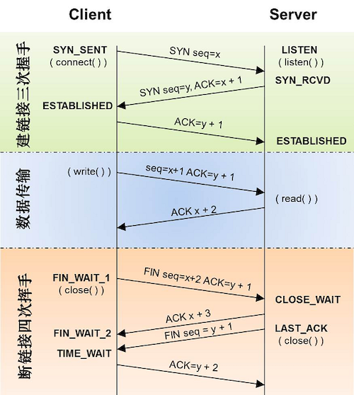
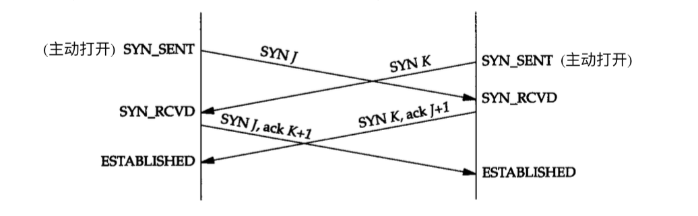
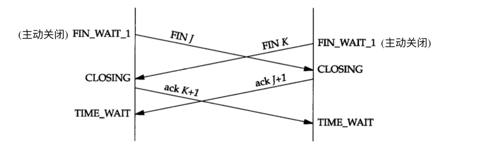
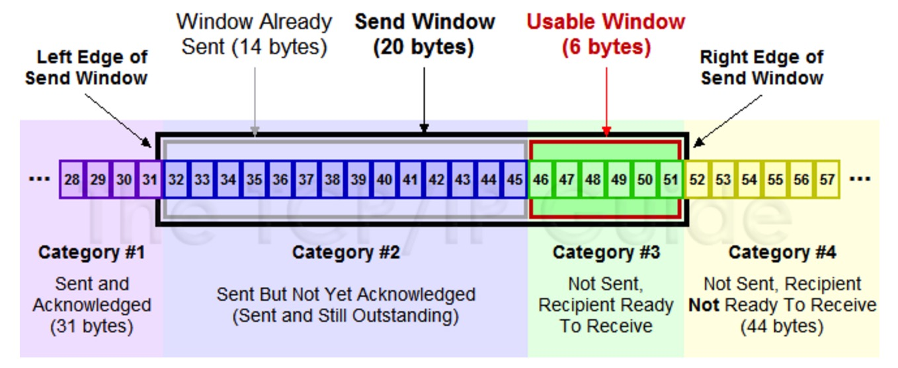
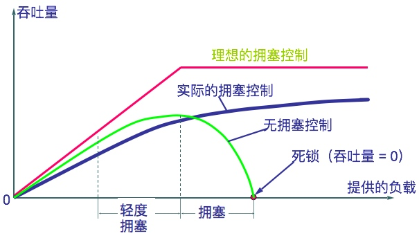
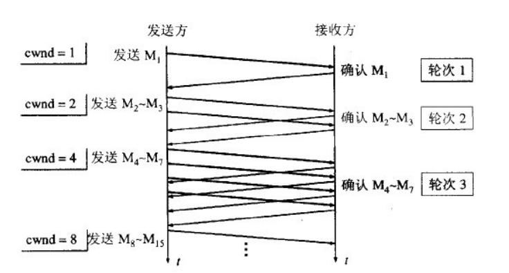
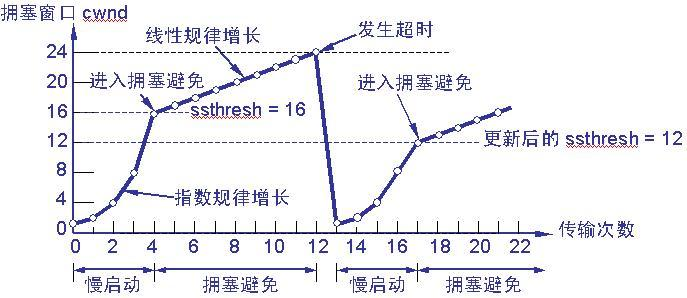
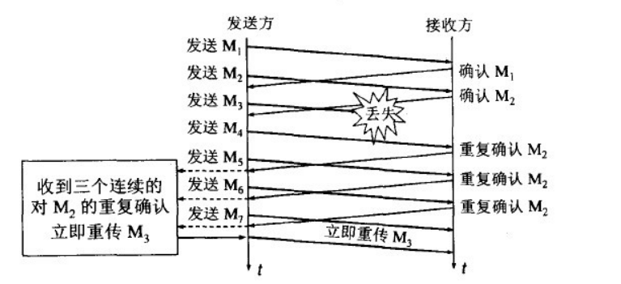
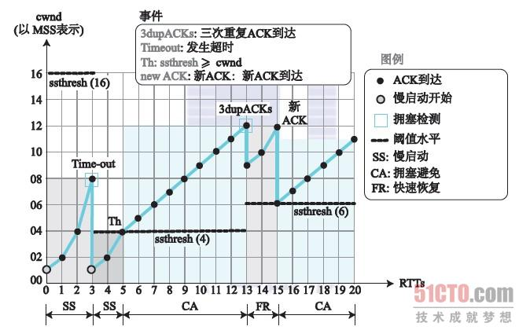

## TCP 首部

#### 源端口号 Source Port 和目的端口号 Destination Port
用于寻找发端和收端应用进程。这两个值加上 IP 首部中的源端 IP 地址和目的端 IP 地址唯一确定一个 TCP 连接。

#### 序号字段 Sequence Number
序号用来标识从 TCP 发端向 TCP 收端发送的数据字节流，它表示在这个报文段中的的第一个数据字节。

如果将字节流看作在两个应用程序间的单向流动，则  TCP 用序号对每个字节进行计数。序号是 32bit 的无符号数，序号到达 2^32 - 1 后又从0开始。

当建立一个新的连接时，SYN 标志变1。序号字段包含由这个主机选择的该连接的初始序号 [ISN（Initial Sequence Number）](https://blog.csdn.net/zhangqi_gsts/article/details/50617291)。初始化序列号不能设置为一个固定值，因为这样容易被攻击者猜出后续序列号，从而遭到攻击。

#### 确认序号 Acknowledgment Number
既然每个传输的字节都被计数，确认序号包含发送确认的一端所期望收到的下一个序号。因此，确认序号应当是上次已成功收到数据字节序号加 1。只有 ACK 标志为 1 时确认序号字段才有效。

发送ACK无需任何代价，因为 32bit 的确认序号字段和 ACK 标志一样，总是 TCP 首部的一
部分。因此，一旦一个连接建立起来，这个字段总是被设置， ACK 标志也总是被设置为1。

TCP 为应用层提供全双工服务。这意味数据能在两个方向上独立地进行传输。因此，连接的每一端必须保持每个方向上的传输数据序号。

#### 首都长度 Offset
首部长度给出首部中 32bit 字的数目。需要这个值是因为选项字段的长度是可变的。这个字段占 4bit，首部长度计算公式为 2^4 * 4byte。 因此 TCP 最多有 60byte 的首部。然而，没有选项字段，正常的长度是 20byte。

#### 标志字段 TCP Flags
在 TCP 首部中有 6 个标志比特。它们中的多个可同时被设置为1.
- URG 紧急指针有效。
- ACK 确认序号有效。
- PSH 接收方应该尽快将这个报文段交给应用层。
- RST 重建连接。
- SYN 同步序号用来发起一个连接。
- FIN 发端完成发送任务。

#### 窗口大小 Window
TCP 的流量控制由连接的每一端通过声明的窗口大小来提供。窗口大小为字节数，起始于确认序号字段指明的值，这个值是接收端正期望接收的字节。窗口大小是一个 16bit 字段，因而 TCP 的标准窗口最大为 2^16-1=65535 字节。

#### 检验和 Checksum
检验和覆盖了整个的 TCP 报文段：TCP 首部和 TCP 数据。这是一个强制性的字段，一定是由发端计算和存储，并由收端进行验证。

#### 紧急指针 Urgent Pointer
只有当 URG 标志置 1 时紧急指针才有效。紧急指针是一个正的偏移量，和序号字段中的值相加表示紧急数据最后一个字节的序号。 TCP 的紧急方式是发送端向另一端发送紧急数据的一种方式。

#### 选项 TCP Options
最常见的可选字段是最大报文段长度，又称为 [MSS (Maximum Segment Size)](https://baike.baidu.com/item/MSS/3567802)。每个连接方通常都在通信的第一个报文段（为建立连接而设置 SYN 标志的那个段）中指
明这个选项。它指明本端所能接收的最大长度的报文段。TCP 的 RFC 定义这个 MSS 的默认值是 536。

TCP 的选项字段中还包含了一个 TCP 窗口扩大因子，option-kind 为 3，option-length 为 3 个字节，option-data 取值范围0-14。窗口扩大因子用来扩大 TCP 窗口，可把原来 16bit 的窗口，扩大为 31bit。

## TCP 连接建立与终止

 

 

### TIME_WAIT 状态
TIME_WAIT 状态也称为 2MSL 等待状态。每个具体TCP实现必须选择一个报文段最大生存时间 MSL (Maximum Segment Lifetime)。MSL 是任何报文段被丢弃前在网络内的最长时间，超过这个时间报文将被丢弃。
> RFC 793 [Postel 1981c] 指出MSL为2分钟。然而，实现中的常用值是30秒，1分钟， 或2分钟。

2MSL 即两倍的 MSL，当 TCP 的一端发起主动关闭，在发出最后一个 ACK 包后，即第 3 次握 手完成后发送了第四次握手的 ACK 包后就进入了 TIME_WAIT 状态，必须在此状态上停留两倍的 MSL 时间

在 TIME_WAIT 状态下两端的端口不能使用，要等到 2MSL 时间结束才可继续使用。当连接处于 2MSL 等待阶段时任何迟到的报文段都将被丢弃。于是，这个 TCP 连接在 2MSL 等待期间，定义这个连接的插口 (客户的 IP 地址和端口号，服务器的 IP 地址和端口号)不能再被使用，而只能在 2MSL 结束后才能再被使用。

#### 等待 2MSL 的目的 （或者说 TIME_WAIT 状态的作用）
1. 四次挥手的最后一个 ACK 包对方没收到，那么对方在超时后，将重发第三次握手的 FIN 包，主动关闭端接到重发的 FIN 包后可以再发一个 ACK 应答包。如果主动关闭方不进入 TIME_WAIT 以维护其连接状态，则当被动关闭方重发的 FIN 达到时，主动关闭方的 TCP 传输层会以 RST 包响应对方，这会被对方认为有错误发生。
2. 让旧的数据包在网络因过期而消失。防止由旧有的连接的迟到报文段被新连接收到，而引起数据错乱

### 半关闭连接
TCP 提供了连接的一端在结束它的发送后还能接收来自另一端数据的能力，即是半关闭。

### 半打开连接
如果一方已经关闭或异常终止连接而另一方却还不知道，我们将这样的 TCP 连接称为半打开（Half-Open）的 。

### 复位报文段

一般说来，无论何时一个报文段发往基准的连接（referenced connection）出现错误，TCP都会发出一个复位报文段（这里提到的“基准的连接”是指由目的IP地址和目的端口号以及源IP地址和源端口号指明的连接。）

#### 1. 访问不存在的端口

一个数据报到达目的端口时，该端口没被监听使用，TCP 会发送复位报文

#### 2. 处理半打开连接

服务端（或客户端）关闭或者异常终止了连接，而对方没有收到结束报文段（可能发生网络故障），此时客户端（或服务器）还维持原来的连接。如果客户端（或服务器）往处于半打开状态的连接写数据，则对方也会回复一个复位报文段。

#### 3. 异常终止连接

TCP协议提供了异常终止一个连接的方法，即给对方发送一个复位报文段，一旦发送了该报文，发送端所有排队等待发送的数据都将被丢弃，接收端将关闭或者重新建立连接。

### 同时打开

两个应用程序同时彼此执行主动打开的情况是可能的。每一方必须发送一个SYN，且这些SYN必须传递给对方。这需要每一方使用一个对方熟知的端口作为本地端口。另外，这种情况下需要进行 4 次握手。

### 同时关闭

## TCP 数据传输
TCP 通信量如果按照分组数量计算，有一半的 TCP 报文段包含成块数据(如 FTP、电子邮件和 Usenet 新闻 )，另一半则包含交互数据 (如 Telnet 和 Rlogin )。如果按字节计算，则成块数据与交互数据的比例约为 90% 和 10%。这是因为成块数据的报文段基本上都是满长度（full-sized）的（通常为 512 字节的用户数据），而交互数据则小得多。

很明显，TCP需要同时处理这两类数据，但使用的处理算法则有所不同。交互式数据，应该解决怎样才能减少小分组的数量传输。

### 交互式数据流
为了提高网络传输效率，需要想办法减少网络中小分组的传输数量。

#### 时延确认
通常 TCP 在接受到数据时并不会立即发送 ACK；相反，它延迟发送， 以便将 ACK 与需要沿该方向发送的数据一起发送。

TCP 使用了一个 200ms 的定时器，该定时器以相对于内核引导的 200ms 固定时间溢出。由于将要确认的数据是随机到达的，TCP 在内核的 200ms 定时器的下一次溢出时得到通知。这有可能是将来1~200 ms中的任何一刻。

> HostRequirements RFC 声明 TCP 需要实现一个经受时延的 ACK，但时延必须小于 500ms。

#### Nagle 算法

TCP/IP 协议中，无论发送多少数据，总是要在数据前面加上协议头，同时，对方接收到数据，也需要发送 ACK 表示确认。所以，为了尽可能的利用网络带宽，TCP 总是希望尽可能的发送足够大的数据。（在一个连接中会设置 MSS 参数，TCP/IP 希望每次都能够以 MSS 尺寸的数据块来发送数据）。Nagle 算法就是为了尽可能发送大块数据，避免网络中充斥着许多小数据块。

该算法要求一个TCP连接上最多只能有一个未被确认的未完成的小分组，在该分组的确认到达之前不能发送其他的小分组。所谓“小”,指的是小于 MSS 尺寸的数据块,所谓“未被确认”，是指一个数据块发送出去后，没有收到对方发送的 ACK 确认该数据已收到。

Nagle算法的规则：
- 如果包长度达到 MSS，则允许发送；
- 如果该包含有FIN，则允许发送；
- 设置了 TCP_NODELAY 选项，则允许发送；
- 未设置 TCP_CORK 选项时，若所有发出去的小数据包（包长度小于 MSS ）均被确认，则允许发送；
- 上述条件都未满足,但发生了超时（一般为 200ms），则立即发送.

该算法的优越之处在于它是自适应的：确认到达得越快，数据也就发送得越快。而在希望减少微小分组数目的低速广域网上，则会发送更少的分组。

对于实时性要求较高的应用场景，可以通过设置TCP_NODELAY参数来关闭Nagle算法，提高性能。

### 成块数据流
需要考虑发送和接受缓存的大小，以及网络拥塞等情况，从而提高网络传输速度

#### 滑动窗口
滑动窗口协议是传输层进行流控的一种措施，接收方通过 TCP 头里的 Window 字段通告发送方自己还有多少缓冲区可以接收数据，于是发送方就可以根据这个接收端的处理能力来发送数据，从而控制发送方的发送速度

发送方根据收到 ACK 当中的期望收到的下一个字节的序号n以及窗口m，加上当前已经发送的字节序号x，就能算出还可以发送的字节数 y=m-(x-n)

##### 滑动窗口大小为 0 的情况
滑动窗口大小为 0 时，发送端就不发数据了，但发送端会使用一个持续定时器 (persist timer)来周期性地 向接收方查询，以便发现窗口是否已增大。当 persist timer 到期时，TCP 发送方尝试恢复发送一个小的 ZWP 包（Zero Window Probe），期待接收方回复一个带着新的接收窗口大小的确认包。一般 ZWP 包会设置成3次，每次大约30-60 秒，如果3次过后还是0的话，有的 TCP 实现就会发 RST 把链接断了

##### 糊涂窗口综合症 Silly Window Syndrome

接收方可以通告一个小的窗口(而不是一直等到有大的窗口时才通告)，而发送方也可以发送少量的数据 (而不是等待其他的数据以便发送一个大的报文段)。于是可能出现接收方太忙了，来不及取走 Receive Windows 里的数据，那么发送方发送的报文段就会越来越小，导致网络中充斥这小分组，降低传输效率。

解决方法：
- 接收端不通告小窗口。直到接收端处理了一些数据后 windows size 大于等于了 MSS，或者，接收端 buffer 有一半为空，就可以把窗口打开了
- 发送端可以使用 nagle 算法，减少小分组传输

## TCP 超时和重传

TCP 提供可靠的运输层。因此需要确认从另一端收到的数据。但数据和确认都有可能会丢失。TCP 通过在发送时设置一个定时器来解决这种问题。如果当定时器溢出时还没有收到确认，它就重传该数据。

此关键在于，怎样决定超时的时间间隔。在不同的网络情况下，不能设定固定的值， 而只能通过动态地计算出 TCP 连接的往返时间 (Round Trip Time，RTT) ，即一个数据包从发出去到回来的时间，然后通过 RTT 计算出 RTO（Retransmission TimeOut）。

### TCP 拥塞控制

如果网络上的延时突然增加，那么，TCP对这个事做出的应对只有重传数据，但是，重传会导致网络的负担更重，于是会导致更大的延迟以及更多的丢包。这个情况就会进入恶性循环，最终可能会拖垮整个网络。因此，TCP 必须在拥塞发生的时候，控制发送的数据包数量

拥塞控制主要有以下四个算法
- 慢启动
- 拥塞避免
- 拥塞发生
- 快速恢复

#### 慢启动（slow-start）和拥塞避免（congestion avoidance）

拥塞避免算法和慢启动算法需要对每个连接维持两个变量: 一个拥塞窗口 cwnd 和一个慢启动门限 ssthresh。
- 对一个给定的连接，初始化 cwnd 为 1 个报文段，ssthresh 为 65535 个字节
- TCP 的输出不能超过 cwnd 和接收方通告窗口的大小 
- 当拥塞发生时(超时或收到重复确认)，ssthresh 被设置为当前窗口大小的一半(cwnd 和接收方通告窗口大小的最小值，但最少为 2 个报文段)。此外，如果是超时引起了拥塞，则 cwnd 被设置为 1 个报文段(这就是慢启动)
- 当新的数据被对方确认时，就增加 cwnd，但增加的方法依赖于我们是否正在进行慢启动或拥塞避免。如果 cwnd 小于或等于 ssthresh，则正在进行慢启动，否则正在进行拥塞避免。
    - 慢启动算法初始设置 cwnd 为 1 个报文段，此后每收到一个确认就加 1 
    - 拥塞避免算法要求每次收到一个确认时将 cwnd = cwnd + 1/cwnd，每过一个 RTT 时，cwnd = cwnd + 1

#### 快速重传（fast retransmit）和快速恢复（fast recovery）

快速重传机制要求接收方每收到一个失序的 TCP 报文段后就立即发出重复确认，发送方只要连续收到3个重复确认就应当立即重传未被确认的报文段。

快速回复算法实现如下
- 当收到第3个重复的 ACK 时，将 ssthresh 设置为当前拥塞窗口 cwnd 的一半。重传丢失的报文段。设置 cwnd 为 ssthresh 加上3倍的报文段大小
- 每次收到另一个重复的 ACK 时，cwnd 增加 1 个报文段大小并发送 1 个分组(如果新的 cwnd 允许发送)。
- 当下一个确认新数据的 ACK 到达时，设置 cwnd 为 ssthresh。这个 ACK 应该是在进行重传后的一个往返时间内对步骤1中重传的确认。另外，这个 ACK 也应该是对丢失的分组和收到的第1个重复的 ACK 之间的所有中间报文段的确认 

另外，收到第3个重复的 ACK 的情况下，没有执行慢启动，是因为收到重复的 ACK 不仅仅告诉我们一个分组丢失了。由于接收方只有在收到另一个报文段时才会产生重复的 ACK，而该报文段已经离开了网络并进入了接收方的缓存。也就是说，在收发两端之间仍然有流动的数据，而我们并不想执行慢启动来突然减少数据流。

## TCP 各种定时器

#### 1. 连接建立定时器 Connection-Establishment Timer

在TCP三次握手创建一个连接时，以下两种情况会发生超时：
- client发送SYN后，进入SYN_SENT状态，等待server的SYN+ACK。
- server收到连接创建的SYN，回应SYN+ACK后，进入SYN_RECD状态，等待client的ACK。
  

当超时发生时，就会重传，一直到75s还没有收到任何回应，便会放弃，终止连接的创建。但是在Linux实现中，并不是依靠超时总时间来判断是否终止连接，而是依赖重传次数。

#### 2. 重传定时器 Retransmission Timer

当三次握手成功，连接建立，发送 TCP segment，等待 ACK 确认。如果在指定时间内，没有得到 ACK，就会重传，一直重传到放弃为止。

#### 3. 延迟确认定时器  Delayed ACK Timer

前文已述，略。

#### 4. 持续定时器 Persist Timer

如果某一时刻，一方发现自己的 socket read buffer 满了，无法接收更多的 TCP data，于是在接下来的发送包中指定通告窗口的大小为 0，这样对方就不能接着发送 TCP data 了。如果 socket read buffer 有了空间，可以重设通告窗口的大小在接下来的 TCP segment 中告知对方。可是万一这个 TCP segment 不附带任何 data，所以即使这个 segment 丢失也不会知晓。对方没有接受到，便不知通告窗口的大小发生了变化，也不会发送 TCP data。这样双方便会一直僵持下去。

TCP协议采用这个机制避免这种问题：对方即使知道当前不能发送TCP data，当有data发送时，过一段时间后，也应该尝试发送一个字节。这段时间便是 Persist Timer 。

#### 5. Keepalive Timer 

TCP socket 的 SO_KEEPALIVE option，主要适用于这种场景：连接的双方一般情况下没有数据要发送，仅仅就想尝试确认对方是否依然在线。

具体实现方法：TCP每隔一段时间（tcp_keepalive_intvl）会发送一个特殊的 Probe Segment，强制对方回应，如果没有在指定的时间内回应，便会重传，一直到重传次数达到 tcp_keepalive_probes 便认为对方已经crash了。

#### 6. FIN_WAIT_2 Timer

当主动关闭方想关闭 TCP connection，发送 FIN 并且得到相应 ACK，从 FIN_WAIT_1 状态进入 FIN_WAIT_2 状态，此时不能发送任何 data 了，只等待对方发送 FIN。可以万一对方一直不发送 FIN 呢？这样连接就一直处于 FIN_WAIT_2 状态，也是很经典的一个 DoS。因此需要一个 Timer，超过这个时间，就放弃这个 TCP connection 了。

#### 7. TIME_WAIT Timer
前文已述，略

## 问题
#### TCP 如何实现可靠性传输？
- 超时重传机制
    - 当TCP 发出一个段后 ，它启动一个定时器，等待目的端确认收到这个报文段。如果不能及时收到一个确认，将重发这个报文段。
- ACK 确认机制
    - 当 TCP 收到发自 TCP 连接另一端的数据，它将发送一个确认。
- TCP 将保持它首部和数据的检验和。错误包丢弃。
    - 这是一个端到端的检验和，目的是检测数据在传输过程中的任何变化。如果收到段的检验和有差错， TCP 将丢弃这个报文段和不确认收到此报文段(希望发端超时并重发)。
- 对失序数据重新排序
    - TCP 报文段的到达可能会失序。如果必要， TCP 将对收到的数据进行重新排序，将收到的数据以正确的顺序交给应用层。
- TCP 接收端会丢弃重复的数据。
- 流量控制，防止较快主机致使较慢主机的缓冲区溢出 
    - TCP 连接的每一方都有固定大小的缓冲空间。TCP 的接收端只允许另一端发送接收端缓冲区所能接纳的数据。

#### 为什么需要 TIME_WAIT 状态

#### 如何防止和解决 TIME_WAIT 数量太多

#### TCP 断开连接，为什么是4次挥手，可以不可以3次？TCP 建立连接，会不会出现 4次 握手

#### 滑动窗口和拥塞窗口分别是什么，各有什么作用

#### 为什么说 TCP 面向字节流传输

---
参考自
- 《TCP-IP 详解》 TCP 相关章节
- [TCP 的那些事儿（上）](https://coolshell.cn/articles/11564.html)
- [TCP 的那些事儿（下）](https://coolshell.cn/articles/11609.html)
- [TCP协议的那些超时](http://blog.qiusuo.im/blog/2014/03/19/tcp-timeout/)